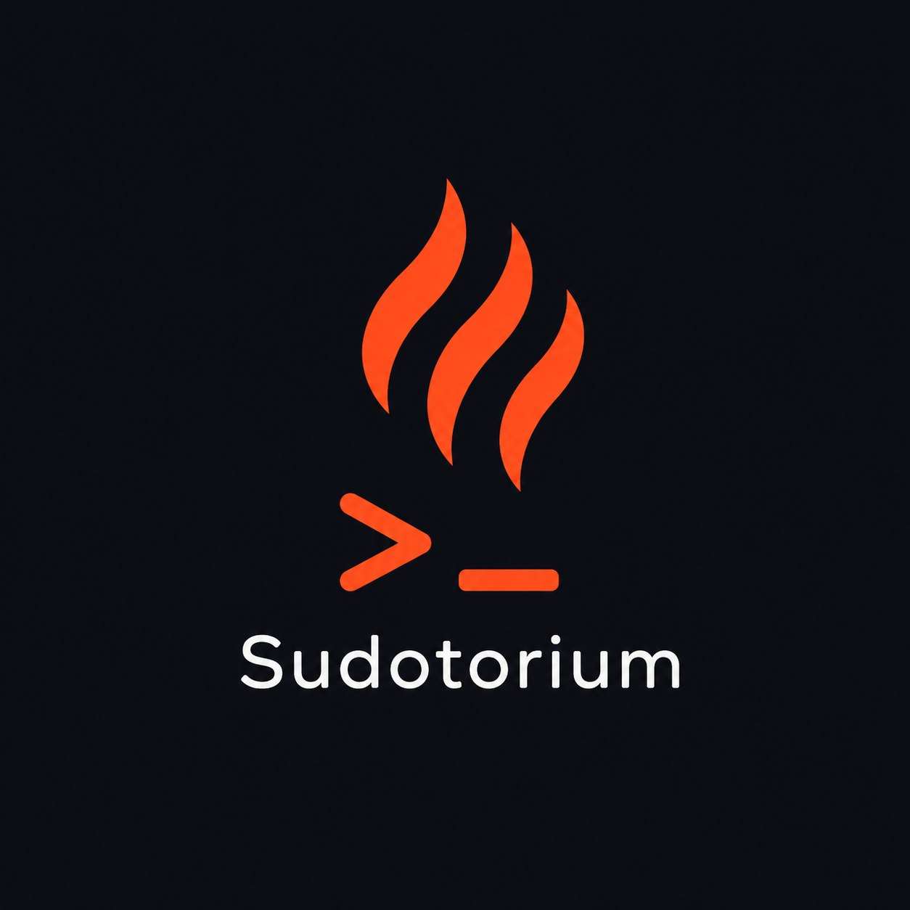
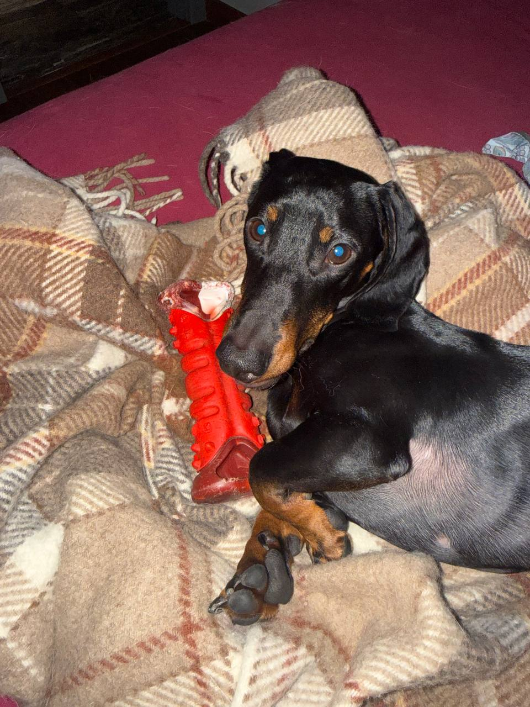
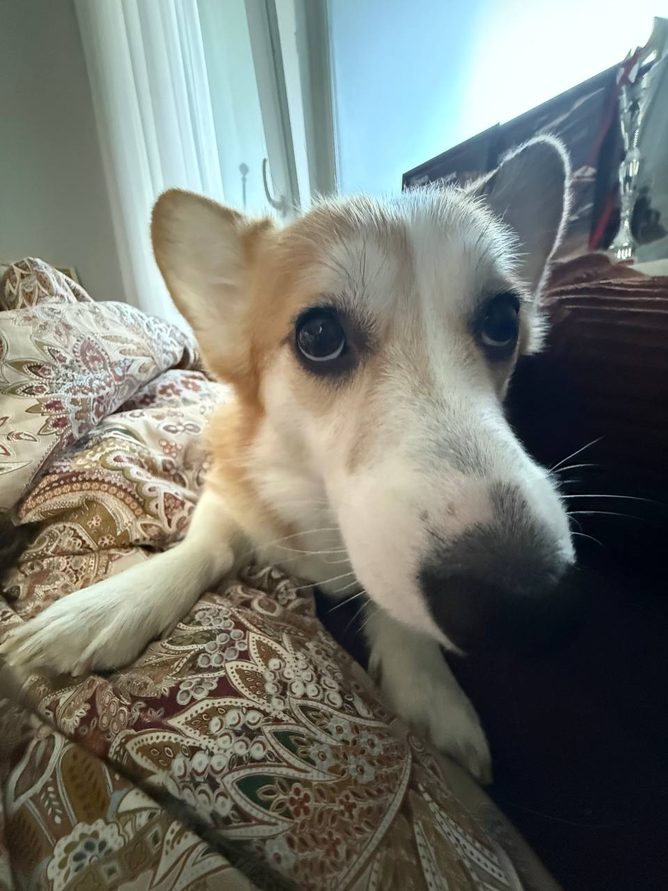

<!-- Положите файл логотипа в assets/logo.png — см. assets/README.md -->

# Sudotorioum

### Краткий и цепляющий слоган в одну строку

  <a href="#о-нас">О нас</a> •
  <a href="#чем-мы-занимаемся">Чем мы занимаемся</a> •
  <a href="#технологии">Технологии</a> •
  <a href="#команда">Команда</a> •
  <a href="#контакты">Контакты</a>

---

## О нас

Наша команда программистов, симбиоз эстетики северной столицы и теплоты Севастопольских портов. Тот самый случай,
когда разные люди нашли общий язык, общее дело, общее увлечение.

> 💡 *Банька, парилка, программирование и...*

## Чем мы занимаемся

- 🚀 **Worker-order** — Сервис сканирование заказ-нарядов
- 🛠️ **Barter Service** — Сервис обмена автомобилей

## Технологии

## Статистика

## Команда

|                                               | Имя                | Роль          | GitHub |
|-----------------------------------------------|--------------------|---------------|---|
|  | Андрей Виноградов  | ML/Backend    | [@Vinandydy](https://github.com/Vinandydy) |
|  | Михаил Угрюмов     | Backend/Frontend | [@umlerr](https://github.com/umlerr) |
|  | Владислав Таланков | Backend       | [@nekoshaurman](https://github.com/nekoshaurman) |

## Контакты

---

© 2026 Парилка программиста. Все права защищены.

